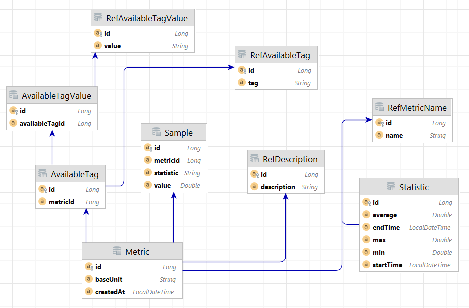

## Kafka monitoring system  
  
Система мониторинга, которая отслеживает работу приложения.  
Система включает в себя два микросервиса:  
- __Producer__ для отправки метрик;  
- __Consumer__ для их обработки и анализа.  
  
В __Producer__ реализован API для отправки метрик:  
`POST /metrics` - Отправка метрик работы приложения в формате JSON.

OpenAPI __Producer__ доступен по ссылке: `http://localhost:8080/swagger-ui/index.html`  
  
В __Consumer__ реализован API для просмотра метрик:  
`GET /metrics` - Получение списка всех метрик;  
`GET /metrics/{id}` - Получение метрики по ее идентификатору.  
  
Также реализован API для просмотра статистики:  
`GET /statistics` - Получение всей статистики;  
`GET /statistics/{id}` - Получение статистики по ее идентификатору.

OpenAPI __Consumer__ доступен по ссылке: `http://localhost:8081/swagger-ui/index.html`  

### Инструкция по запуску

Для запуска кафки и базы данных необходимо из корневой директории проекта вызвать команду:  
`docker-compose up`  
Затем необходимо запустить **metrics-producer** и **metrics-consumer** приложения.

Подключиться к базе данных можно со следующими настройками:  
`host: localhost`    
`port: 5435`  
`database: monitoring_system`  
`username: postgres`    
`password: postgres`

### Документация  
  
В ходе работы __Producer__ отправляет метрики каждые пять секунд, __Consumer__ их обрабатывает и сохраняет в базу данных.  

Каждую минуту собирается статистика по сохраненным метрикам. В базу данных сохраняются:  
- Максимальное значение метрики за последнюю минуту;
- Минимальное значение метрики за последнюю минуту;  
- Среднее значение метрики за последнюю минуту.  

Чтобы реализовать обработку статистики для новой метрики нужно:  
1) Наследоваться от класса **MetricAnalyzer**;  
2) Переопределить метод **analyzeMetric()**.  

Так как метрики в базе данных накапливаются быстро, структура базы была спроектирована таким образом, чтобы как можно более сократить дублирование данных.  

**ER-диаграмма** структуры базы данных:  

